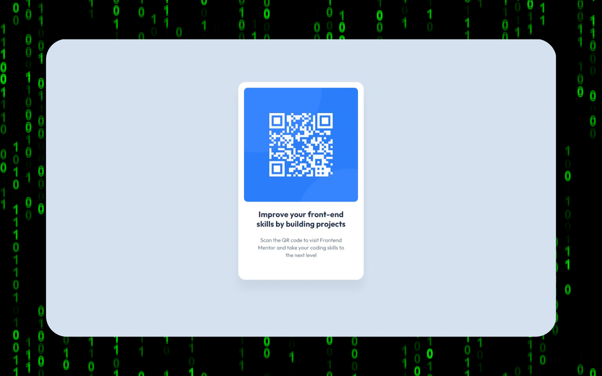

# Frontend Mentor - QR code component solution

This is a solution to the [QR code component challenge on Frontend Mentor](https://www.frontendmentor.io/challenges/qr-code-component-iux_sIO_H). Frontend Mentor challenges help you improve your coding skills by building realistic projects.

## Table of contents

- [Overview](#overview)
  - [Screenshot](#screenshot)
  - [Links](#links)
- [My Process](#my-process)
  - [Built with](#built-with)
  - [What I Learned](#what-i-learned)
  - [Continued Development](#continued-development)
  - [Useful Resources](#useful-resources)
- [Author](#author)
- [Acknowledgments](#acknowledgments)

## Overview

This is a simple QR code component created for educational purposes. You can click on it to visit the website that provided the task for this project.

### Screenshot



### Links

- Solution URL: [GitHub](https://github.com/lemonbw/qr-code-component)
- Live Site URL: [GitHub Pages](https://lemonbw.github.io/qr-code-component/)

## My process

### Built with

- Semantic HTML5 markup
- CSS custom properties
- Flexbox

### What I learned

I strengthened my knowledge of using Flexbox to center elements on a page and properly connecting fonts. Additionally, I learned how to use Figma to create and work with project layouts.

```html
<main id="container">
  <div id="qr-image">
    
  </div>
  <div id="text-container">
    <h1 id="improve">Improve your front-end...</h1>
    <p id="scan">Scan the QR code...</p>
  </div>
</main>
```

```css
body {
  position: relative;
  display: flex;
  justify-content: center;
  align-items: center;
  height: 100vh;
  overflow-y: hidden;
}

#container {
  display: flex;
  flex-direction: column;
  align-items: center;
}
```

### Continued development

I want to study Flexbox and Grid in detail, as well as various popular fonts used in web design. Additionally, I plan to implement the JavaScript language in my future projects.

### Useful resources

- [Learn HTML!](https://web.dev/learn/html/) - This is the course where I learned detailed documentation on HTML.
- [Learn CSS!](https://web.dev/learn/css?hl=ru) - I completed another great course on web.dev, where I familiarized myself with the documentation on css.
- [Git, GitHub, & GitHub Desktop for beginners](https://www.youtube.com/watch?v=8Dd7KRpKeaE) - I followed a tutorial by Jessica Chan that helped me understand Git technologies for version control.

## Author

- GitHub - [My GitHub account](https://github.com/lemonbw)
- VK - [My VK account](https://vk.com/leonblackwhite)
- Frontend Mentor - [@lemonbw](https://www.frontendmentor.io/profile/lemonbw)

## Acknowledgments

I would like to thank Frontend Mentor for providing the task.
